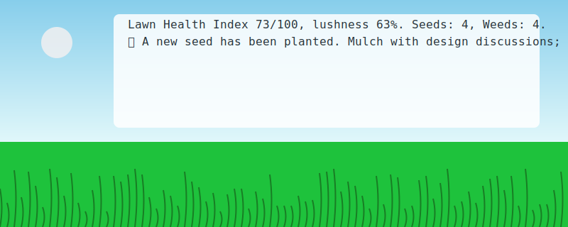

# AstroTurf

Because the grass isn’t greener over there — it’s greener where you water it. And by "water" we obviously mean open pull requests, triage issues, and sharpen mower blades in CI.

AstroTurf is a tiny, intentionally silly repo that treats your project like a lawn. PRs are seeds, issues are weeds, CI is the mower, and dashboards are… well, lawn gnomes with charts.



## What is this?
A parody “observability” toy that generates a lawn dashboard and story out of repo-ish events. It updates a whimsical SVG and a short narrative in `garden.md`, backed by a JSON blob of totally serious lawn telemetry.

## The silly bits
- Seeds vs Weeds: PRs are seeds 🌱, issues are weeds 🌾. Open one, watch the lawn stats wiggle.
- Lawn Health Index: A very robust, extremely scientific number out of 100.
- Lushness: 0–100% greenness. Higher = more grass blades drawn in the SVG.
- Sprinkler Pipelines: Cron-like watering jobs with flaky, wind-induced failures.
- Mower CI: Build warns, tests flake, blades occasionally unsharpened. Real-life vibes.
- Observability: Logs from `GnomeService` and `WeedDaemon`, traces like `bee-flight`.
- Security: Gnome firewall enabled. Mole tunnels detected. HedgeAuth via OIDC (Open Ivy Dandelion Connect).

## How it works
`scripts/garden_bot.py` is the whole show:
1. Reads and updates `lawn-health.json` with event-driven drift.
2. Writes a little story about your lawn’s current mood.
3. Renders `garden.svg` (a sky, a grass strip, and lines of narrative).
4. Refreshes `garden.md` to display the latest status and story.
5. Drops tiny breadcrumb files in `seedlings/` (for seeds) and `weeds/` (for weeds).

It can run in CI (e.g., GitHub Actions) or locally. It looks for `GITHUB_EVENT_NAME` and `GITHUB_REF_NAME` to guess what just happened, but it happily runs without them.

## What you’ll see in the repo
- `scripts/garden_bot.py`: Generates everything and updates metrics with a wink.
- `garden.svg`: The live lawn card (auto-generated).
- `garden.md`: A short, auto-updated story plus the SVG.
- `lawn-health.json`: The canonical source of green truth and brown lies.
- `seedlings/`: One text file per planted seed (PR-ish).
- `weeds/`: One text file per new weed (issue-ish), created on demand.

## Run it locally
Requirements: Python 3.9+.

```bash
python3 scripts/garden_bot.py
```

That will:
- Update `lawn-health.json`
- Re-render `garden.svg`
- Refresh `garden.md`
- Potentially create `seedlings/` or `weeds/` entries

Open `garden.md` or `garden.svg` in your viewer of choice to admire the turf.

## Pretend you’re CI (for extra silliness)
Simulate different event types by setting `GITHUB_EVENT_NAME`:

```bash
# Pretend an issue just opened
GITHUB_EVENT_NAME=issues python3 scripts/garden_bot.py

# Pretend a pull request just opened
GITHUB_EVENT_NAME=pull_request python3 scripts/garden_bot.py

# Nudge the lawn via a push or a scheduled tick
GITHUB_EVENT_NAME=push python3 scripts/garden_bot.py
GITHUB_EVENT_NAME=schedule python3 scripts/garden_bot.py
```

You can also optionally set a branch/ref-ish hint (parsed for numbers like PR IDs):

```bash
GITHUB_EVENT_NAME=pull_request GITHUB_REF_NAME=refs/pull/123/merge \
  python3 scripts/garden_bot.py
```

## Why does this exist?
Because SRE/DevOps dashboards needed more chlorophyll. It’s a playful nudge at metrics, pipelines, and the eternal struggle against dandelions (null pointers) and crabgrass (merge conflicts).

## Contributing
Plant a seed (PR). Pull a weed (close an issue). Water with tests. Mulch with docs. Beware aphids: flaky specs.

## License
See `LICENSE`.
